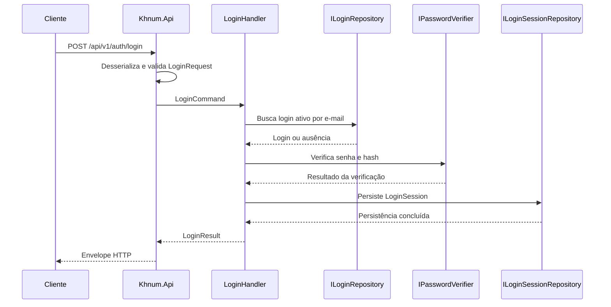

# Fluxo do caso de uso Login

## Sequência principal



## Fluxo de sucesso

1. A API recebe `email` e `password`.
2. A validação confirma e-mail válido e senha com pelo menos seis caracteres.
3. O handler busca um login ativo pelo e-mail normalizado.
4. O verificador compara a senha recebida com `PasswordHash`.
5. O handler cria uma sessão com UUID v4, timestamps UTC e expiração.
6. A sessão é persistida com referência ao login.
7. A API responde HTTP 200:

```json
{
  "status": "SUCCESS",
  "message": "Sessão criada com sucesso.",
  "dth": "2026-09-12T14:30:00Z",
  "data": {
    "token": "a8098c1a-f86e-11da-bd1a-00112444be1e"
  }
}
```

## Fluxos de falha

### Validação

A requisição é rejeitada antes da consulta ao banco quando o e-mail é inválido, ausente ou a senha não atende ao tamanho mínimo.

- HTTP: `400`.
- `status`: `VALIDATION_ERROR`.
- `data`: `null`.
- `message`: descreve as inconsistências sem expor dados sensíveis.

### Autenticação

Login inexistente, inativo ou senha incorreta seguem o mesmo resultado externo:

- HTTP: `401`.
- `status`: `FAILED`.
- `message`: `Credenciais inválidas ou usuário inativo.`
- `data`: `null`.
- Nenhuma sessão é criada.

Essa uniformidade evita a enumeração de usuários.

## Persistência e consistência

A criação da sessão deve ocorrer dentro da unidade de trabalho do caso de uso. Se a persistência falhar, a resposta não deve conter um token que não foi gravado.

O SQLite deve operar com foreign keys habilitadas. O token deve ser a chave primária da sessão e `login_id` deve referenciar `logins.id`.

A implementação usa EF Core SQLite com `Foreign Keys=True` na string de conexão, índice único `NOCASE` para o e-mail normalizado e `PasswordHasher` (PBKDF2-HMAC-SHA256) para verificar hashes. A inicialização também executa `PRAGMA foreign_keys = ON` antes de criar o schema.

## Testes mínimos

- Login válido cria exatamente uma sessão e retorna o mesmo token persistido.
- Login inativo não cria sessão.
- Senha incorreta não cria sessão.
- Entrada inválida não consulta o repositório.
- O envelope possui `data: null` em falhas.
- O token retornado é um UUID v4.
