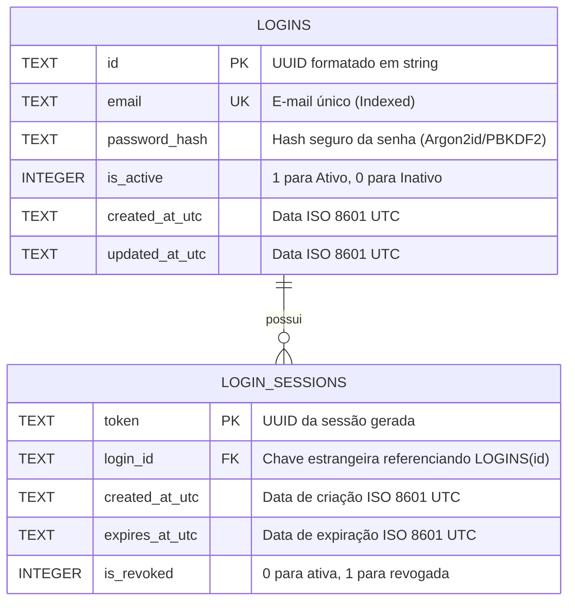

# Especificação Técnica: Serviço de Login

- **Feature:** Autenticação e Gestão de Sessão de Login
- **Status:** Aprovado para Implementação
- **Data:** 2026-09-12
- **Banco de Dados:** SQLite (arquivo local / embedded)

---

## 1. Visão Geral e Requisitos

Implementar uma API que forneça o serviço de login com persistência em SQLite, realizando:
1. Validação dos dados de entrada (`email` e `password`).
2. Verificação de existência e correspondência de credenciais na tabela de login onde o status esteja **ativo**.
3. Criação e persistência de uma sessão de login com identificador único (`UUID`) no SQLite.
4. Retorno padronizado no envelope:
   ```json
   {
     "status": "<status_do_processo>",
     "message": "<mensagem_de_retorno>",
     "dth": "<data_hora_retorno>",
     "data": {
       "token": "<uuid_da_sessao_login_criada>"
     }
   }
   ```

---

## 2. Especificação de Contrato (OpenAPI 3.1)

```yaml
openapi: 3.1.0
info:
  title: Khnum Auth Service
  version: 1.0.0
  description: Serviço de autenticação com persistência em SQLite e emissão de token de sessão (UUID).
paths:
  /api/v1/auth/login:
    post:
      summary: Realiza autenticação, valida status ativo e cria sessão de login
      operationId: login
      requestBody:
        required: true
        content:
          application/json:
            schema:
              $ref: '#/components/schemas/LoginRequest'
      responses:
        '200':
          description: Login realizado com sucesso e sessão registrada
          content:
            application/json:
              schema:
                $ref: '#/components/schemas/LoginResponse'
        '400':
          description: Erro de validação nos dados de entrada
          content:
            application/json:
              schema:
                $ref: '#/components/schemas/LoginResponse'
        '401':
          description: Credenciais incorretas ou usuário inativo
          content:
            application/json:
              schema:
                $ref: '#/components/schemas/LoginResponse'

components:
  schemas:
    LoginRequest:
      type: object
      required: [email, password]
      properties:
        email:
          type: string
          format: email
          example: "usuario@khnum.io"
        password:
          type: string
          minLength: 6
          example: "SenhaForte@123"

    LoginResponseData:
      type: object
      required: [token]
      properties:
        token:
          type: string
          format: uuid
          example: "a8098c1a-f86e-11da-bd1a-00112444be1e"

    LoginResponse:
      type: object
      required: [status, message, dth]
      properties:
        status:
          type: string
          example: "SUCCESS"
          enum: ["SUCCESS", "FAILED", "VALIDATION_ERROR"]
        message:
          type: string
          example: "Sessão criada com sucesso."
        dth:
          type: string
          format: date-time
          example: "2026-09-12T14:30:00Z"
        data:
          $ref: '#/components/schemas/LoginResponseData'
          nullable: true
```

---

## 3. Especificação Comportamental Executável (BDD / Gherkin)

```gherkin
Funcionalidade: Autenticação de Usuário e Criação de Sessão
  Como um cliente da API Khnum
  Quero enviar credenciais de e-mail e senha
  Para validar o acesso e receber o token UUID da sessão ativa

  Contexto:
    Dado que a base de dados SQLite está inicializada e acessível

  Cenário: Login efetuado com sucesso para usuário ativo
    Dado que existe um registro na tabela de login com:
      | Email            | Senha          | IsActive |
      | usuario@khnum.io | SenhaForte@123 | true     |
    Quando for enviada uma requisição POST para "/api/v1/auth/login" com:
      | email            | password       |
      | usuario@khnum.io | SenhaForte@123 |
    Então o código HTTP retornado deve ser 200
    E o campo "status" da resposta deve ser "SUCCESS"
    E o campo "message" deve ser "Sessão criada com sucesso."
    E o campo "data.token" deve conter um UUID v4 válido
    E deve existir um registro na tabela de sessões do SQLite vinculado ao usuário com esse mesmo token

  Cenário: Falha de autenticação para usuário inativo
    Dado que existe um registro na tabela de login com:
      | Email            | Senha          | IsActive |
      | inativo@khnum.io | SenhaForte@123 | false    |
    Quando for enviada uma requisição POST para "/api/v1/auth/login" com:
      | email            | password       |
      | inativo@khnum.io | SenhaForte@123 |
    Então o código HTTP retornado deve ser 401
    E o campo "status" da resposta deve ser "FAILED"
    E o campo "message" deve ser "Credenciais inválidas ou usuário inativo."
    E o campo "data" deve ser nulo
    E nenhum novo registro deve ser inserido na tabela de sessões do SQLite

  Cenário: Falha de autenticação com senha incorreta
    Dado que existe um registro na tabela de login com:
      | Email            | Senha          | IsActive |
      | usuario@khnum.io | SenhaForte@123 | true     |
    Quando for enviada uma requisição POST para "/api/v1/auth/login" com:
      | email            | password     |
      | usuario@khnum.io | SenhaErrada! |
    Então o código HTTP retornado deve ser 401
    E o campo "status" da resposta deve ser "FAILED"
    E o campo "message" deve ser "Credenciais inválidas ou usuário inativo."
    E o campo "data" deve ser nulo
    E nenhuma sessão deve ser criada

  Cenário: Falha de validação nos campos de entrada
    Quando for enviada uma requisição POST para "/api/v1/auth/login" com:
      | email         | password |
      | emailinvalido |          |
    Então o código HTTP retornado deve ser 400
    E o campo "status" da resposta deve ser "VALIDATION_ERROR"
    E o campo "message" deve detalhar as inconsistências de validação
    E o campo "data" deve ser nulo
```

---

## 4. Especificação da Base de Dados (SQLite)

### 4.1. Diagrama de Entidade-Relacionamento



### 4.2. DDL SQLite

```sql
-- Habilita suporte a Foreign Keys no SQLite
PRAGMA foreign_keys = ON;

CREATE TABLE IF NOT EXISTS logins (
    id TEXT PRIMARY KEY NOT NULL,
    email TEXT NOT NULL COLLATE NOCASE,
    password_hash TEXT NOT NULL,
    is_active INTEGER NOT NULL DEFAULT 1 CHECK (is_active IN (0, 1)),
    created_at_utc TEXT NOT NULL,
    updated_at_utc TEXT NOT NULL
);

CREATE UNIQUE INDEX IF NOT EXISTS ix_logins_email ON logins(email);

CREATE TABLE IF NOT EXISTS login_sessions (
    token TEXT PRIMARY KEY NOT NULL,
    login_id TEXT NOT NULL,
    created_at_utc TEXT NOT NULL,
    expires_at_utc TEXT NOT NULL,
    is_revoked INTEGER NOT NULL DEFAULT 0 CHECK (is_revoked IN (0, 1)),
    FOREIGN KEY (login_id) REFERENCES logins(id) ON DELETE CASCADE
);

CREATE INDEX IF NOT EXISTS ix_login_sessions_login_id ON login_sessions(login_id);
CREATE INDEX IF NOT EXISTS ix_login_sessions_token ON login_sessions(token);
```

---

## 5. Diretrizes Técnicas de Implementação em .NET

1. **Provider de Dados:**
   - Pacote NuGet: `Microsoft.EntityFrameworkCore.Sqlite`
   - Connection String padrão: `Data Source=khnum_auth.db;Cache=Shared`

2. **Segurança de Senhas:**
   - Hash criptográfico usando `Microsoft.AspNetCore.Identity.PasswordHasher<T>` ou biblioteca dedicada de Argon2id. Nunca persistir senhas em texto plano.

3. **Validação de Contrato de Entrada:**
   - `FluentValidation` validando obrigatoriedade de formato de e-mail e tamanho mínimo de senha antes de consultar o banco.
